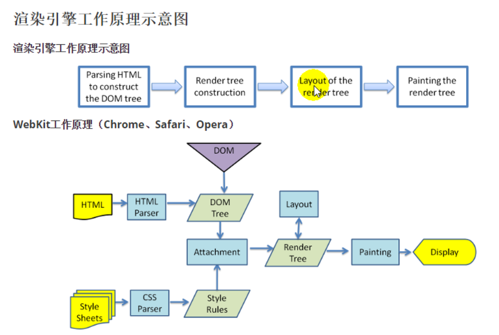

- 2020年8月31日23:31:04
- 我也是醉了，这个node_study_3.0  说明这个已经是第三次鼓起勇气去学习node了  之前的学习都是
半途而废 这次是有计划的 争取完完整整的学习一下node 

- 浏览器的工作原理
1. 解析HTML构建DOM树(Document object model，文件对象模型)   css样式会生成 规则树
2. 构建 渲染树  渲染树不同于Dom树 像head标签或者display:none 这样的元素就没有必要放到渲染树上了
3. 对 渲染树 进行布局 定位坐标 确认是否换行 等等  这个过程我们称之为 layout 或者 reflow
4. 绘制 渲染树  调用操作系统的api进行页面的绘制

---

---

- 想要查看reflow的过程 https://www.youtube.com/watch?v=ZTnIxIA5KGw  老师说这个的目的就是 尽可能的一次操作Dom树 你多次操作的话
需要多次的reflow 这样会比较消耗性能的。
- 本机上  F12  点击...  More tools    rendering    paint flashing   然后刷新页面  可以看到页面闪啊闪
