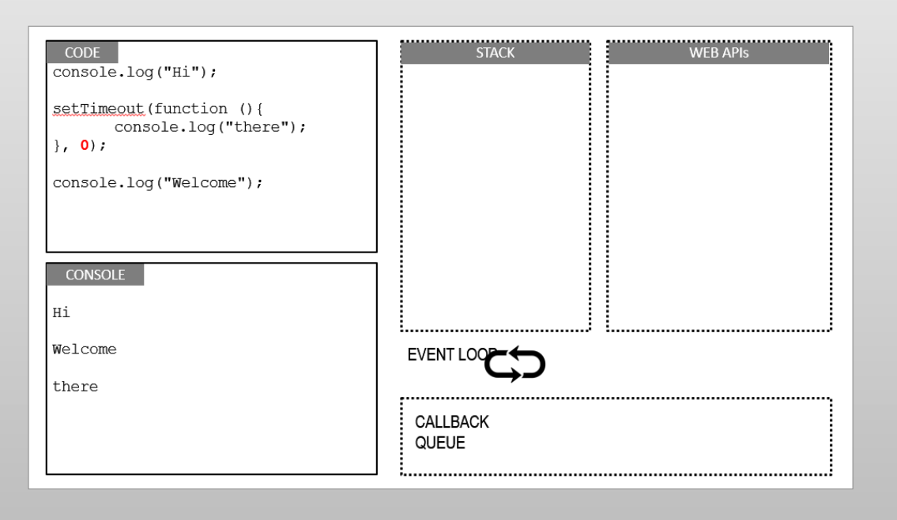

- 2020年8月31日23:31:04
- 我也是醉了，这个node_study_3.0  说明这个已经是第三次鼓起勇气去学习node了  之前的学习都是
半途而废 这次是有计划的 争取完完整整的学习一下node 

- 浏览器的工作原理
1. 解析HTML构建DOM树(Document object model，文件对象模型)   css样式会生成 规则树
2. 构建 渲染树  渲染树不同于Dom树 像head标签或者display:none 这样的元素就没有必要放到渲染树上了
3. 对 渲染树 进行布局 定位坐标 确认是否换行 等等  这个过程我们称之为 layout 或者 reflow
4. 绘制 渲染树  调用操作系统的api进行页面的绘制

---

---

- 想要查看reflow的过程 https://www.youtube.com/watch?v=ZTnIxIA5KGw  老师说这个的目的就是 尽可能的一次操作Dom树 你多次操作的话
需要多次的reflow 这样会比较消耗性能的。
- 本机上  F12  点击...  More tools    rendering    paint flashing   然后刷新页面  可以看到页面闪啊闪

浏览器访问网站的过程
- 在浏览器中输入网址   
- 浏览器通过用户在地址栏中输入的URL构建HTTP请求报文
- 浏览器发送DNS解析请求 将域名转为IP地址
- 浏览器将请求报文发送给服务器
- 服务器接收请求报文 并解析
- 服务器处理用户的请求 并将处理结果封装成响应报文
- 服务器将HTTP响应报文发送给浏览器
- 浏览器接收服务器的HTTP报文 并解析
- 浏览器解析HTML页面并展示 在解析的过程中如果遇到新的资源需要再次发起请求
- 浏览器展示出页面

web开发的本质
- 请求  客户端发起请求
- 处理  服务器处理请求
- 响应  服务器将处理结果发送给客户端

C/S(client/Server)      客户端服务器
B/S(Browser/Server)     浏览器服务器

什么是node?
- 需要注意的是 node不是一个编程语言  它是一个开发平台  就像java开发平台 .net开发平台
- 该平台使用的是JavaScript语言
- node.js 平台是基于chrome V8 JavaScript引擎构建

node.js 全栈开发技术栈 MEAN - MongoDB Express Angular Node.js

node特点
- 事件驱动(当事件被触发的时候，自然而然的执行代码)
- 非阻塞I/O模型(当执行I/O操作的时候，不会阻塞线程)
- 单线程的
- 拥有世界上最大的开源库生态系统 -npm

为什么要配置环境变量？
我C盘的根目录下有LOL.exe  我在命令窗口C:目录下执行  LOL.exe 没有任何问题  因为C盘的根目录下是有这个程序的 如果我切换到D盘下 
再次执行 LOL.exe 就不生效  因为没有  我们在环境变量中配置C盘根路径以后  在D盘下执行LOL.exe 发现D盘下没有  就去环境变量中一个
一个的去寻找 看看哪个环境变量下有LOL.exe这个执行程序  这个就是配置环境变量的意义

node的管理工具  nvm (就是有一些情况  你需要多个版本的node 我们就可以通过用nvm进行版本管理)
注意事项
- 第一个路径是你nvm的路径 第二个路径是你node的路径  
- 如果你已经安装了node 会在安装的过程中提示你 是否需要添加进版本管理
- 命令工具 用管理员的身份打开  
- nvm install 的过程可能会非常的慢  我们需要在nvm安装目录的setting里面去配置镜像地址
    node_mirror: https://npm.taobao.org/mirrors/node/
    npm_mirror: https://npm.taobao.org/mirrors/npm/
    
nvm -v
nvm list                - 查看已经安装的node的版本
nvm install latest      - 安装最新的版本node
nvm install 12.9.0      - 安装指定版本的node
nvm uninstall 12.9.0    - 卸载已经安装的版本
nvm user 版本号          - 使用你指定的版本

node和传统的java web项目的区别：主要的区别就是有没有web容器

REPL: Read-Eval-Print-Loop(交互式解释器)
cmd  然后 node

创建JavaScript文件 编写程序

创建JavaScript的时候注意事项
- 不要用中文
- 不要包含特殊字符等等
- 不要包含node关键字

简单的js执行   node   需要执行的js路径 以及名称

*我们在使用node的某些模块的时候  如果是全局模块的话 就不需要使用require()函数的方式进行加载  反之我们就需要使用require()这种方式*
怎么确认一个模块是否是Global模块？ 答：查看node文档  具体的模块看看有没有引入 我们查看
---

--- 

---

--- 
- 针对上面的图进行说明下 
1. 主要有3块区域  调用栈  底层API  回调队列  
2. 调用栈中的执行顺序是 先进后出
3. 函数在调用栈中顺序执行  如果遇到异步函数   会跑到WEB API中进行执行  等到执行完毕后  函数就会放到  回调队列 
4. 不停的去队列里面查看  还有没有事件没有执行

- 如果想要了解的话 请查看http://latentflip.com/loupe 里面有演示执行的过程
- 如果还是不清楚的话  请查看15-node.js视屏 老师讲解的很明白

error-first 错误优先   fs.writeFile fs.readFile 后面的callback函数里面的参数  error 都是在第一个位置 所以你懂的

- try catch 只能捕获同步操作的异常 不能捕获异步操作的异常  一般我们是通过回调函数里面的信息进行判断的

- 在请求服务器的时候 请求的url它其实就是一个标识  这个的主要意思就是不是根据你请求的路径的后缀去判断返回什么(有可能你请求xxx.css
 我们给你返回一个index.html文件)
 
- request和response
- 获取用户请求的相关信息 我们都可以用request进行获取  
- 凡是需要向客户端响应的操作 我们都可以用response进行获取

NPM node package manage  一般我们安装好node已经 就自动已经安装npm了
- 更新最新的npm 
npm install npm@latest -g  (后面的-g 表示的是全局安装 全局安装的意思是 安装好这个模块 你就可以把这个模块当做命令行使用了
不是说，你执行完命令后  在项目中就不用再进行安装了)

只有能通过  require 加载的模块  才是模块

package.json、package-lock.json 文件介绍
元数据：描述自己的数据(比如拿到的档案信息)

package.json 
- 是一个包说明文件，用来管理组织一个包
- 是一个json格式的文件
- 位于当前项目的根目录

常见的项有哪些？
- name (包的名称)   必须项
- version (版本)   必须项
- description(包描述
- main(包的入口文件 从main字段中指定那个js文件开始执行)
- dependencies(当前包依赖的其他包)

怎么创建package.json文件
npm init命令 或者 npm init -y  或者 npm init -yes  或者手动创建  (老版本 创建的时候不要包含大写字母 也不要包含中文字符)

package-lock.json (是npm5+ 以上才会有的这个文件)
1. 安装之后锁定包的版本，手动更改package.json文件安装将不会更新包，想要更新只能使用 npm install xxx@1.0.0 --save
 这种方式来进行版本更新package-lock.json 文件才可以
2. 加快了npm install 的速度，因为 package-lock.json 文件中已经记录了整个 node_modules 
文件夹的树状结构，甚至连模块的下载地址都记录了，再重新安装的时候只需要直接下载文件即可

 

